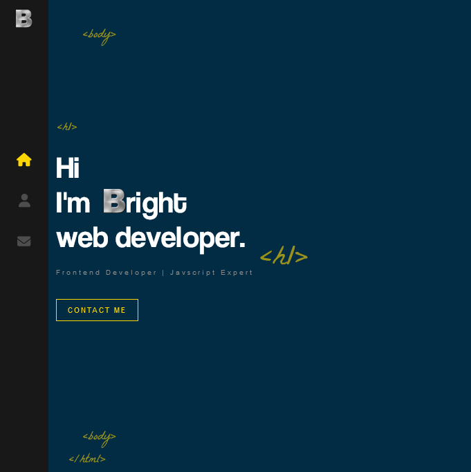

## Sample React Portfolio Website

# Frontend Mentor - News homepage solution

This is a solution to the [News homepage challenge on Frontend Mentor](https://www.frontendmentor.io/challenges/news-homepage-H6SWTa1MFl). Frontend Mentor challenges help you improve your coding skills by building realistic projects.

## Table of contents

- [Overview](#overview)
  - [The challenge](#the-challenge)
  - [Screenshot](#screenshot)
  - [Links](#links)
- [My process](#my-process)
  - [Built with](#built-with)
  - [What I learned](#what-i-learned)
  - [Continued development](#continued-development)
- [Author](#author)

## Overview

### The challenge

Users should be able to:

- View the website
- See hover and focus states for all interactive elements on the page

### Screenshot

### Links

- Solution URL: [Click here](https://github.com/Brighties/sample-react-portfolio-website)
- Live Site URL: [Click Here](https://jocular-torrone-8f126f.netlify.app/)

## My process

### Built with

- Semantic HTML5 markup
- CSS custom properties
- Flexbox
- Desktop-first workflow
- SASS
- React

### What I learned

- CSS Anmations
- Components, hooks, router-dom in React
- and many more...

### Continued development

- Add more pages and make the newly added pages responsive.
- Make it mobile responsive

## Author

- Frontend Mentor - [@Bright](https://www.frontendmentor.io/profile/Brighties)
- Twitter - [@bright_snipe](https://www.twitter.com/bright_snipe)
